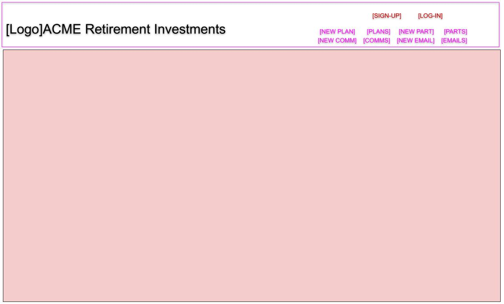
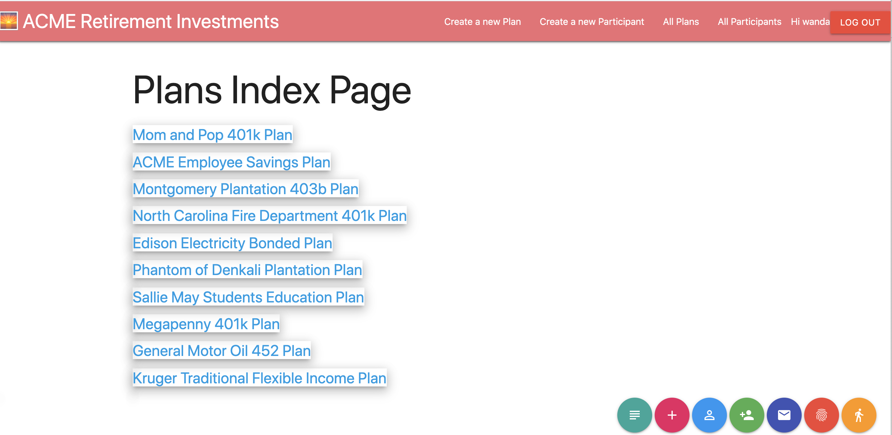

# Project 2. 🌅 ACME Investments - Plans Participants Funds


## 1. Technologies used

* HTML, CSS, JavaScript, Google Chrome
* Express Node.js Web App Framework, 
* EJS Templates to implement MVC (Model–view–controller) design Pattern
* REST (Representational state transfer) Architecture using JavaScript and JSON
* Materialize Framework for styling (Based on Google Material Design) 
* Object-oriented, dynamic, scalable NoSQL database MongoDB on Cloud 
* Compass GUI for MongoDB
* Mongoose ODM (Object Data Modeling) library for MongoDB and Node.js
* MongoDB Atlas to connect to cloud service provider of choice - AWS
* Heroku Cloud Application Platform for Deployment
* Deployed at https://mohan-project-2.herokuapp.com/

## 2. Learning Experience

* MongoDB / Mongoose - The NoSQL and Object Oriented Database is new to me and quite exciting. I am used to traditional relational databases like DB2, MS SQL Server, Sybase or Star Schema Focus
* EJS Layouts Party Hat / Squiggleys <% %> to embed dynamic JavaScript code in HTML is pretty nice
* The Materialize library was a pleasure to work with - providing out of the box styling elements. Some of the good features I found after solidifying the MVP have been added to a special page named Plan Sponsor Email

## 3. Approach & Design Components - Wireframe, REST Table and Seeding

### 3.1 Wireframe

  

### 3.2 REST Table

Each of tht Plan RESTful routes were coded based on the table below

<table>
<thead>
<tr>
<th>Rt#</th>
<th>Path</th>
<th>HTTP Verb</th>
<th>Purpose</th>
<th>Mongoose Method</th>
</tr>
</thead>
<tbody>
<tr>
<td>1</td>
<td>/plans</td>
<td>GET</td>
<td>List all plans </td>
<td>Plan.find()</td>
</tr>
<tr>
<td>2</td>
<td>/plans/new</td>
<td>GET</td>
<td>Show new plan form</td>
<td>N/A</td>
</tr>
<tr>
<td>3</td>
<td>/plans</td>
<td>POST</td>
<td>Create a new plan, then redirect somewhere</td>
<td>Plan.create()</td>
</tr>
<tr>
<td>4</td>
<td>/plans/:id</td>
<td>GET</td>
<td>Show info about one specific plan</td>
<td>Plan.findById()</td>
</tr>
<tr>
<td>5</td>
<td>/plans/:id/edit</td>
<td>GET</td>
<td>Show edit form for one plan</td>
<td>Plan.findById()</td>
</tr>
<tr>
<td>6</td>
<td>/plans/:id</td>
<td>PUT</td>
<td>Update particular plan, then redirect somewhere</td>
<td>Plan.findByIdAndUpdate()</td>
</tr>
<tr>
<td>7</td>
<td>/plans/:id</td>
<td>DELETE</td>
<td>Delete a particular plan, then redirect somewhere</td>
<td>Plan.findByIdAndRemove()</td>
</tr>
</tbody>
</table>

### 3.3 Seed Processes

Data for the collections were generated using stand alone Seed process listed below

```JavaScript
const mongoose = require('mongoose');
const Plan = require('../models/plan');
const Participant = require('../models/participant');
const mongoURI = 'mongodb://localhost/project-2-dev';
mongoose.connect(
  mongoURI,
  {
    useNewUrlParser: true,
    useUnifiedTopology: true,
    useFindAndModify: false,
    useCreateIndex: true,
  },
  () => {
    console.log('the connection with mongod is established');
  }
);
(async function () {
  //await mongoose.connection.dropCollection('plans');
  //await mongoose.connection.dropCollection('participants');
  // CREATE TWO PARTICIPANTS
  const gates = await Participant.create({
    partName: 'Bill Gates',
    partSsn: '123-45-6789',
    partIsHce: true, // Higly Compensated Employee :D
    partIsActive: true,
  });
  const palat = await Participant.create({
    partName: 'Mohan Palat',
    partSsn: '987-65-4321',
    partIsHce: false, 
    partIsActive: true,
  });
  // CREATE TWO PLANS
  const aesp = new Plan({
    planName: 'ACME Employee Savings Plan',
    planIsInstitutional: true,
    participants: [],
  });
  const map401k = new Plan({
    planName: 'Mom and Pop 401k Plan',
    planIsInstitutional: false,
    participants: [],
  });
  // PUSH THE PARTICIPANTS ONTO THE PLAN'S
  // PARTICIPANTS ARRAY (ASSOCIATE!)
  aesp.participants.push(gates);
  map401k.participants.push(palat); 
  aesp.save(function (err, plan) {
    if (err) {
      console.log(err);
    } else {
      console.log('first plan is ', plan);
    }
  });
  map401k.save(function (err, plan) {
    if (err) {
      console.log(err);
    } else {
      console.log('second plan is ', plan);
    }
  });
})();
```

## 4. Technical Requirements

Company ACME Retirement Investments deals with clients who will become participants investing in plans which ACME will offer them. Plans are a combination of funds which are investment vehicles which the participants can invest in by buying shares. I was recruited as a full stack deeloper to develop web forms which could maintain all the plans ACME offers, participants who have invested in each plan and their association 

### 4.1 Problem: 

ACME wants to maintain (Create, Read, Update, Delete) their plans, participants and maybe the funds belonging to the plan and the associations between using a web app.

### 4.2 Solution and who would use it

It will be used by the Plan/Participant Maintenance and Plan Sponsor team to view the plan properties and how they can improve the participant experience on web.

#### 4.2.1 UI Soutioning
Used HTML, CSS, JavaScript, Google Chrome, Express Node.nj Framework, EJS Templates and Materialize Framework for styling 

#### 4.2.2 Data Storage Soutioning
MongoDB/Compass and Mongoose ODM 

#### 4.2.3 Solutioning Cloud Deployment to AWS
Heroku Cloud Application Platform for Deploment

## 5. User Stories and their implementation status

* As a user, I should be able list all the retirement plans of 🌅 ACME Retirement Investments **Status: Complete**
* As a user, I should be able list all the participants of 🌅 ACME Retirement Investments **Status: Complete**
* As a user, I should be able to click on plan and be able to view details (show page) **Status: Complete**
* As a user, when I am on the above show page, I should be able to edit and save the changes **Status: Complete**
* As a user, when I am on the above show page, I should be able delete the plan **Status: Complete**
* As a user, when I am on the above show page, I should be able to go back to plan list page without making any changes **Status: Complete**
* As a user, I should be able to get a web page where I can add a new plan **Status: Complete**
* As a user, I should be should be able to enter a Sponsor eMail for the plan with eMail validation **Status: Complete**
* As a user, I should be able to view the same header / Layout look and feel for every page I visit with ACME's Sunrise logo visible **Status: Complete**
* As a user, when I visit the Participant and Plan Index pages, the listing must have an embossed feeling with a shadow **Status: Complete**
* As a user, when I do data entry the toggle (Y/N) fields must display as check boxes **Status: Complete**
* As a user, I would like a button menu at the bottom which will make it easy for me if I use a tablet or my cell (be responsive) **Status: Complete**

## 6. Compliance to MVP (Minimum Viable Product) Requirement 🔴 

* A working full-stack application, built by you, using Node.js, MongoDB, Express and EJS **Complete**
Adhere to the MVC file structure: Models, Views, Controllers **Followed all the MVC requirements. Folders were structured as below such that there is no clutter**
```
./images
./populate
./models
./seeds
./controllers
./views
./views/participants
./views/plans
./views/emails
./views/sessions
./views/users
./views/partials
```
* At least one model with all 7 RESTful routes and full CRUD. **Plan model was created with all 7 RESTful routes and full CRUD**
* At least 2 models that are associated in some way (e.g. one-to-many, many-to-many, etc) **Plan and Participant models with association by reference. Fund model created with embedded association.**  
* ❗ A git repository not inside the class repo. **[My Personal Repo](https://github.com/Mohan-Palat/project-2/)**
* At least one Github commit per day. **Multiple commits at every logical checkpoint as below**
```
Commit 01. Initial Commit
Commit 02. Express Server Basic Setup Complete
Commit 03. Heroku Setup Completed
Commit 04. Schemas and Seeding Completed
Commit 05. REST Route 1. Index /plans Completed
Commit 06. REST Route 2, 3 New and Create Completed
Commit 07. REST Route 4, Show Completed
Commit 08. REST Route 5, Show Edit Form Completed
Commit 09. REST Route 6, Update Particular Plan Completed
Commit 10. REST Route 7, Delete Particular Plan Completed
Commit 11. Second Model Participant with Routes 1(List ALL), 2(New), 3(Create)
Commit 12. Sign up/Log in functionality, with encrypted passwords & an authorization flow
Commit 13. Materialize changes to menu and list shadow
Commit 14. Materialize drop down not working as expected, Rolled back    
Commit 15. Added Materialize Button Menu to make it fully responsive   
Commit 16. More Materialize Changes    
Commit 17. Plan Sponsor Email Page with Materialize Changes       
Commit 18. Added Fund model with embedded association for Daily Price Model     
Commit 19. Updates to Nav.ejs
Commit 20. ACME Sunrise After Retirement Logo 🌅 and README.md
```
* At least 10 User Stories **Worked on 12 User Stories (Please refer to Item # 5)** 
* Be deployed online and accessible to the public via Heroku **Complete**

## 7. Compliance to Stretch Goals, Recommended Features 🔵 

* Add additional relationships **Added Fund Model with an embedded association**
* Include sign up/log in functionality, with encrypted passwords & an authorization flow **Complete**
* Use EJS Partials **Complete**
* Include portfolio-quality styling **Almost**
* Use a CSS framework like Bootstrap **Using Materialize Framework**
* Incorporate Google Maps **Did not complete**

## 8. Unsolved Issues and Future Enhancements

* Fund Model was added. The model needs to be associated to Plans and Participants and eventually provide pages using Mongoose .populate() method to a) Given a prticipant, list all associated plans and funds b) Given a plan, provide a list of available funds. 
* Currently there is an issue with the responsive presentation of the UI - The top right menu has been coded to disappear and a hamburger menu appears when size becomes tablet size or lower. If you click the hamburger menu a pullin menu is supposed to slide in from left side. Instead of the slide in menu I am getting the regular menu appearing below the hamburger icon. For now there is a cluster of buttons at the bottom which can be used on tablets and cell phones.  
  

## 9. Mongoose Models and MongoDB Associations used

Plan to Participant is one to many relationship
To match with relational databases, implemented with referenced association
Fund to Price is also one to many implemented with embedded form of association

```JavaScript
// ****************************************
// *              PLAN                    *
// ****************************************

// PARTICIPANT WITH PLAN ASSOCIATION - REFERENCED

const mongoose = require('mongoose');

const planSchema = new mongoose.Schema(
  {
    planName: {
        type: String,
        required: true
    },       
    planIsInstitutional: {
        type: Boolean,
        default: false
    },
    participants: [
      {
        type: mongoose.Schema.Types.ObjectId,
        ref: 'Participant',
      },
    ],
  },
  { timestamps: true }
);

module.exports = mongoose.model('Plan', planSchema);

// ****************************************
// *           PARTICIPANT                *
// ****************************************

const mongoose = require('mongoose');

const participantSchema = new mongoose.Schema(
  {
    partName: {
        type: String,
        required: true,
      },        
    partSsn: {
        type: String,
        default: '',
      },
    partIsHce: {
        type: Boolean,
        default: false,
      },      
    partIsActive: {
        type: Boolean,
        default: true,
      },      
  },
  { timestamps: true }
);

module.exports = mongoose.model('Participant', participantSchema);

// ****************************************
// *              FUND PRICE              *
// ****************************************

const mongoose = require('mongoose');

// FUND DAILY PRICE

const dailyPriceSchema = new mongoose.Schema({
  priceDate: {type: Date, default: Date.now},
  price: Number
});

// ****************************************
// *              FUND                    *
// ****************************************

// FUND WITH DAILY PRICE ASSOCIATION - EMBEDDED

const fundSchema = new mongoose.Schema({
  name: String,
  // embed prices in fund
  prices: [dailyPriceSchema],
});

// FUND PRICE GETTER

dailyPriceSchema.path('price').get(function(num) {
  return (num / 100).toFixed(2);
});

// FUND PRICE SETTER

dailyPriceSchema.path('price').set(function(num) {
  return num * 100;
});

module.exports = mongoose.model('Fund', fundSchema);

/* 
----------------------------------------------
Getter and Setter could also be setup thusly..
----------------------------------------------

const dailyPriceSchema = new mongoose.Schema({
  priceDate : {type: Date, default: Date.now},
  price     : {type: Number, get: getPrice, set: setPrice }
});

function getPrice(num){
    return (num/100).toFixed(2);
}

function setPrice(num){
    return num*100;
}
*/
```


